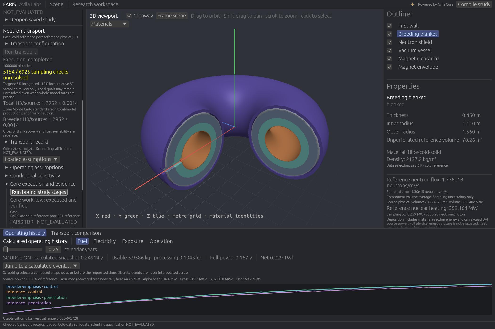

# FARIS

**Fusion Analysis and Reactor Integration Simulator — by Avila Labs.**

FARIS is a Rust project for exploring how a fusion plant's components, fuel
supply, operating history, and maintenance affect one another over its life.
It will combine existing open-source scientific tools with new models where
the chosen research question exposes a gap.

The first demo explores one ARC-inspired compact
D-T tokamak, two blanket/shield arrangements, and a shared 3D scene. The app
uses **egui/eframe for the interface and wgpu for the 3D viewport**, with an
outliner, component inspector, central viewport, and timeline inspired by
Blender's workspace layout.

## Current implementation

- A Rust workspace with separate model, engine, CLI, and desktop crates.
- One versioned scenario with two allocations inside the same radial envelope.
- Strict scenario parsing, geometric validation, and source-file identity.
- Shared full-torus geometry records and display meshes.
- Native GPU rendering, orbit/zoom, cutaway, component picking, visibility,
  arrangement switching, and component dimensions.
- A calculated Rust operating history with decay, processing delay/losses,
  fuel availability, maintenance/replacements, exposure and signed energy ledgers.
- CLI validation, deterministic geometry exports, and optional tool detection.
- Strict transport requests and raw-tally imports, checked source normalization,
  integrated rates, volume averages, units, and Monte Carlo standard errors.
- A Rust external-job runner with time/log bounds and process-group cancellation.
- An independently specified absorber-sphere control that actually runs OpenMC,
  with identified raw inputs/statepoints and scoped numerical comparisons.
- A scientific baseline, benchmark route, and local tool/data readiness audit.
- Typed material, source, and nuclear-data inputs bound to exact scenario bytes.
- Generated study dependencies, actual external Avila Core compilation and
  four-stage execution/evidence binding, verified saved-study reopening, and
  a native Compile study button with cancellation.
- Real OpenMC torus transport for an explicit cold-data surrogate: component
  tritium production, neutron flux, energy spectra, and a 3D Cartesian flux mesh.
- Checked record replay, native transport execution/cancellation, component
  flux/heating/fluence coloring, and spatial-flux slices using calculated values.
- Coupled neutron/photon transport with explicit charged-particle deposition,
  direct total heating, and an independent thermal Li-6 capture control.
- Authored history comparisons and full-rerun sensitivity, with independent
  mass/energy/event controls and measured integration-grid refinement.
- Four corrected million-history coupled cases: two allocations, each with a
  finite outboard port and a matched feature-free control. Cell ownership and
  independent port-volume checks pass; sparse local mesh estimates retain
  unresolved sampling uncertainty.
- An identified ITER_1D execution reference; code-to-code comparison remains
  unavailable without traceable reference responses.

**The scoped functional demo is complete on the recorded Linux workstation.**
Its four corrected coupled transport cases, conservative histories, real Core
receipts, portable exports, and native controls have recorded acceptance evidence.
The default scene
is a geometry preview; the recorded-study launcher opens calculated transport,
histories and verified Core evidence together.
Activation and physical degradation models remain outside the demo. Fuel,
maintenance, exposure-triggered service events and power/energy arithmetic are
conditional on identified transport results and authored assumptions.
Scientific qualification stays `NOT_EVALUATED`, including for
completed transport. Material colors identify layers; calculated field modes
are labeled separately. The bundled starting scenario has unassigned materials. The idealized circular
tori and magnet envelope do not reproduce the published ARC engineering design.



The image shows the corrected finite-port reference case and an actual native
Core execution. The coupled campaign and continuous delayed-release controls are recorded in
[current demo acceptance](docs/DEMO_ACCEPTANCE.md),
[transport refinement](references/transport-refinement-results.json), and
[history verification](docs/OPERATING_HISTORY.md).

The resolved port-window comparison is a declared mixed-volume spatial average,
not a magnet peak or a qualified plant prediction. Neither the remaining local
map uncertainty nor nuclear-data and engineering qualification gaps are hidden
by a successful run or Core receipt.

The local recorded distribution opens all four cases without OpenMC or nuclear
data. From this repository, run:

```bash
dist/FARIS-demo-2026-10-01/verify.sh
dist/FARIS-demo-2026-10-01/launch.sh
```

The distribution lives in ignored `dist/`; source and verification metadata are
on GitHub. Follow the [walkthrough](docs/DEMO_WALKTHROUGH.md) to create or explore
it, and inspect [native acceptance evidence](references/native-demo-verification.json).
Measured orbit/history-scrub throughput was 89.33 egui frames/s on X11 and
62.07 on Wayland; these are measured UI frame rates, not GPU presentation rates.

## Review the current demo build

The workspace is organized as five steps: **Design → Simulate → Operate → Compare → Evidence**
(keys 1–5). The default operating preset makes the magnet envelope demountable at a
literature REBCO fluence screening value (3×10²² n/m², Sorbom et al. 2015); the
Operate timeline shows each magnet swap, and the Compare step shows all four recorded
cases plus a seven-point blanket/shield allocation sweep (real 1M-history port runs,
inputs in `scenarios/arc-inspired/allocation-sweep/`). Swaps and electricity remain
conditional on authored assumptions; transport qualification stays `NOT_EVALUATED`.

```bash
cargo build --release -p faris-app
scripts/launch_review_demo.sh   # recorded package + runs/allocation-sweep/bundles + this build
```

Sweep bundles are made with `faris transport pack --run <run.json> --output <bundle.json>`.

## Run the desktop

Rust 1.98.1 is pinned. The first build needs network access to crates.io unless
dependencies are already cached. Run from this directory:

```bash
cargo run -p faris-app
```

The scenario is embedded, so the desktop also works after its binary is moved.
Load an authored scenario explicitly:

```bash
cargo run -p faris-app -- --scenario scenarios/arc-inspired/scenario.json
```

Drag in the viewport to orbit, Shift-drag to pan, scroll to zoom, and click a component to inspect
it. Use the outliner to select or hide components. The cutaway is a display
operation; it does not change the full-torus model or reported volumes.

The desktop needs a graphical session and compatible graphics drivers.
Linux source builds may need `pkg-config`, `libxkbcommon-dev`, and
`libwayland-dev` from the system package manager. Windows and macOS builds
require their usual Rust native linker/toolchain setup.

Use **Interface size** in the top bar to enlarge text, controls, panels, and
plots together. Ctrl/Cmd + or − adjusts size; Ctrl/Cmd 0 resets it. The 100%
setting follows the desktop's display scaling. To start larger, pass
`--interface-scale 1.25`. Leave display-backend and DPI overrides unset during
normal use so a high-DPI desktop can report its native scale.

Select analyses in the left panel and use **Compile study** in the upper right.
Choose an external Core executable in compiler settings or pass `--core`.
Compilation, run readiness, and scientific assessment are separate. See
[generated Core studies](docs/CORE_STUDIES.md) for the CLI and recorded evidence.

For real transport, use the [cold-reference workflow](docs/COLD_REFERENCE.md).
Provide its scenario, both `--physics` files, the audited data XML, and existing
OpenMC Python/executable paths. The desktop runs the same engine as the CLI.
`--run /path/to/run.json` replays checked local results; `--field-view
flux-slice` starts with calculated spatial fields. Source geometry remains a
full torus. The display cutaway does not change transport.

## Study files

A `.faris` file is one study: both arrangements (with and without the port), the
recorded transport, the allocation sweep, the operating assumptions, and the view
you left open (step, preset, what-if values, year, field view, history tab, selected
arrangement and allocation). Calculated histories are not stored; they recalculate
on opening. The format, its size policy and its reading rules are in
[docs/STUDY_FILE.md](docs/STUDY_FILE.md).

```bash
cargo run -p faris-app -- demo.faris          # or File > Open, Ctrl+O, or drop the file on the window
```

The **File** menu in the top bar has Open, Save, Save as (Ctrl+O, Ctrl+S,
Ctrl+Shift+S). The window title shows the file name and a dot when the view differs
from what was saved. Recorded files are stored byte for byte and checked by hash on
every open, so the Core receipts' "unchanged since checked" guarantee survives a
save. By default the Core evidence archives (about 50 MB for the demo) are recorded by name
and hash, not included; the study opens fully without them and its Evidence step
says the receipts are not included and how to supply them. Tick **Include Core
evidence in saved files** to store them inside. Archives found beside the file at
the recorded relative paths (for example `port/archives/reference-case.tar.gz`
when the file sits at the package root) are checked against their hashes and used.

```bash
faris study-file create --bundle port/bundles/reference.transport-bundle.json \
  --control-bundle control/bundles/reference.transport-bundle.json \
  --sweep-bundle sweep/blanket-045cm.transport-bundle.json \
  --assumptions operating-assumptions.json \
  --evidence saved-study-port-reference.json [--pack-evidence] -o demo.faris
faris study-file inspect demo.faris     # manifest summary and sizes
faris study-file verify demo.faris      # rehash everything; exit 1 on any failure
faris study-file unpack demo.faris out/ # bundles and files back out; refuses an existing directory
```

To open `.faris` files from your file manager on Linux, run
`scripts/install_desktop_integration.sh /absolute/path/to/faris-app` (user-level; add
`--uninstall` to remove it).

## Use the CLI

The default workspace member is the CLI, so headless operations do not build
the graphics stack. Python, OpenMC, and Avila Core are not required:

```bash
cargo run -- validate scenarios/arc-inspired/scenario.json
cargo run -- export --scenario scenarios/arc-inspired/scenario.json --output runs/geometry-001.json
cargo run -- doctor
```

Export refuses an existing destination to preserve previous run records.
`doctor` checks names on `PATH` without executing tools; detection does not
mean a FARIS adapter is available.

The first executable scientific increment is a mathematical transport control:

```bash
cargo run -- control absorber --python /path/to/openmc-env/bin/python \
  --openmc /path/to/openmc-env/bin/openmc --output runs/absorber-001
```

It uses synthetic one-group data, 1,000,000 histories and one thread by default.
The Rust worker caps histories, runtime and captured logs; Ctrl-C cancels its
  solver process group. External execution currently requires Unix. A numerical
control PASS applies only to the declared control, with its sampling rule and
limitations in [NUMERICAL_CONTROLS.md](docs/NUMERICAL_CONTROLS.md). It establishes
no reactor prediction or nuclear-data qualification. Linux jobs have explicit
address-space, file-size, artifact-count and total-output limits; the runner is
not a general sandbox for hostile executables.

Transport imports are independently usable without OpenMC:

```bash
cargo run -- transport validate-request --scenario scenarios/arc-inspired/scenario.json --request /path/to/request.json
cargo run -- transport normalize --scenario scenarios/arc-inspired/scenario.json \
  --request /path/to/request.json --artifact /path/to/raw-tallies.json --output runs/normalized-001.json
```

An import checks definitions and arithmetic; the artifact's solver identities
and raw numbers are adapter assertions. Import success leaves scientific
qualification `NOT_EVALUATED`. See [TRANSPORT.md](docs/TRANSPORT.md) for contracts,
normalization, trust limits and unavailable reactor functionality.

## Development

```bash
cargo fmt --all --check
cargo clippy --workspace --all-targets -- -D warnings
cargo test --workspace
python3 -m unittest discover -s controls -p 'test_*.py'
python3 controls/check_history.py
python3 -m unittest discover -s scripts -p 'test_*.py'
```

Use `--jobs 1` when compiling the graphics stack on a memory-constrained machine.
For a headless core check, run `cargo test -p faris-model -p faris-engine -p faris-cli`.

An opt-in desktop rendering check captures only FARIS's own window and exits:

```bash
cargo run -p faris-app -- --capture runs/desktop-preview.png
```

The screenshot destination's directory must already exist. Screenshots are
development artifacts, not simulation evidence.

## Project map

| Path | Responsibility |
| --- | --- |
| `crates/faris-model/` | Scenario types, units, validation, and identities |
| `crates/faris-engine/` | Shared geometry, transport normalization/jobs, history, comparison and Core evidence |
| `crates/faris-study/` | The `.faris` study file: verified, content-addressed container (no UI) |
| `crates/faris-cli/` | Headless client of the same engine |
| `crates/faris-app/` | Native egui workspace and wgpu renderer |
| `scenarios/arc-inspired/scenario.json` | The single editable demo scenario |
| `docs/DEMO.md` | Demo question, requirements, and completion criteria |
| `docs/ARCHITECTURE.md` | Rust boundaries, units, adapter and evidence design |
| `docs/ROADMAP.md` | Long-term project direction and development phases |
| `docs/DEMO_ROADMAP.md` | Comprehensive demo-only roadmap: dependencies, detailed requirements, and acceptance walkthrough |
| `docs/TOOLING.md` | Open-source tools and planned integration roles |
| `docs/SCIENTIFIC_BASELINE.md` | Benchmark selection, validation scope, uncertainty rules and unresolved scientific inputs |
| `docs/MATERIAL_BASELINE.md` | Primary-source material candidates and inputs that still need resolution |
| `docs/STUDY_FILE.md` | The `.faris` study file: container, size policy, reading rules |
| `docs/TRANSPORT.md` | Strict raw-tally contracts, dimensions and checked Rust normalization |
| `controls/` | Independent analytic controls and external OpenMC numerical checks |
| `references/` | Identified scientific sources and read-only tool/data audits |
| `integrations/` | Scientific adapters, Core template and integration documentation |
| `scripts/` | Portable distribution packaging, bounded extraction and verification |
| `runs/` | Ignored generated records and captures |
| `data/raw/` | Ignored downloaded scientific inputs |

## License and repository

Copyright © 2026 Avila Labs. FARIS source code and documentation are licensed
under the [GNU Affero General Public License, version 3 only](LICENSE)
(`AGPL-3.0-only`). Third-party tools and data retain their respective licenses.

Cargo packages use `publish = false` while the scaffold evolves.
The project repository is [AvilaLabs/FARIS](https://github.com/AvilaLabs/FARIS).
