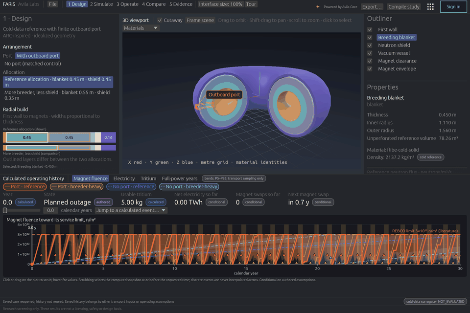

# Welcome to FARIS

FARIS, the Fusion Analysis and Reactor Integration Simulator, follows a fusion plant from 3D neutron transport to thirty years of operation. It shows how a blanket and shield design changes tritium breeding, magnet exposure, component replacements and net electricity year by year, and how sure those numbers are.

This handbook covers **FARIS 0.1.1**.

## This release is a demo

FARIS 0.1.1 is a deliberately narrow demonstration, complete for one study: an ARC-inspired tokamak in four arrangements, from transport to thirty years of operation with uncertainty. The full product widens the geometry and adds activation and peak magnet fluence. [Where FARIS is going](roadmap.md) lists what comes next.

## Research screening only

FARIS results are not a licensing, safety or design basis. Every number is labelled as calculated, authored, literature, conditional or not evaluated. [Reading the numbers](results.md) explains each label. The statement is in the bottom bar of every step and in every export.

## What the demo studies

One compact D-T tokamak, ARC-inspired, with 525 MW of fusion power, in four arrangements:

- Two blanket/shield allocations inside the same radial build.
- For each allocation, a finite outboard service port, and a matched port-free control.

The study asks one question: what changes when you move thickness from the neutron shield to the breeding blanket?

| Part | What you get |
| --- | --- |
| Transport | Coupled neutron/photon OpenMC results: tritium production, heating, flux spectra, a 3D flux map, and fast-neutron flux on three regions of the magnet, each with its Monte Carlo standard error. |
| Operation | A 30-year history that recalculates in about a second as you move sliders: tritium inventory, fuel-limited stops, planned outages, replacements and net electricity. |
| Uncertainty | Hundreds of histories on transport rates sampled from the recorded covariance. Every output gets a median, a 90 % range and event probabilities. |
| Compare | The four arrangements side by side with two-sigma flags, a paired comparison of the ensembles, and a seven-point allocation sweep. |
| Evidence | Avila Core receipts, a `.faris` file that holds the whole study, and export to a PDF brief, CSV tables and charts. |

## Start here

[Download and verify](install.md) the package for Linux, Windows or macOS, then [take the tour](quick-start.md). You do not need OpenMC, nuclear data or a network connection to explore the recorded study.

Then read one chapter for each step of the workspace: [Design](design.md), [Simulate](simulate.md), [Operate](operate.md), [Compare](compare.md) and [Evidence](evidence.md). Read [Reading the numbers](results.md) and [Scope and limits](scope.md) before you quote any result.

## Find help

Use the search button or press `/` to search this handbook. [Troubleshooting](troubleshooting.md) covers the messages the app shows. Report reproducible problems through [GitHub issues](https://github.com/AvilaLabs/FARIS/issues), with your version and the message you saw.
